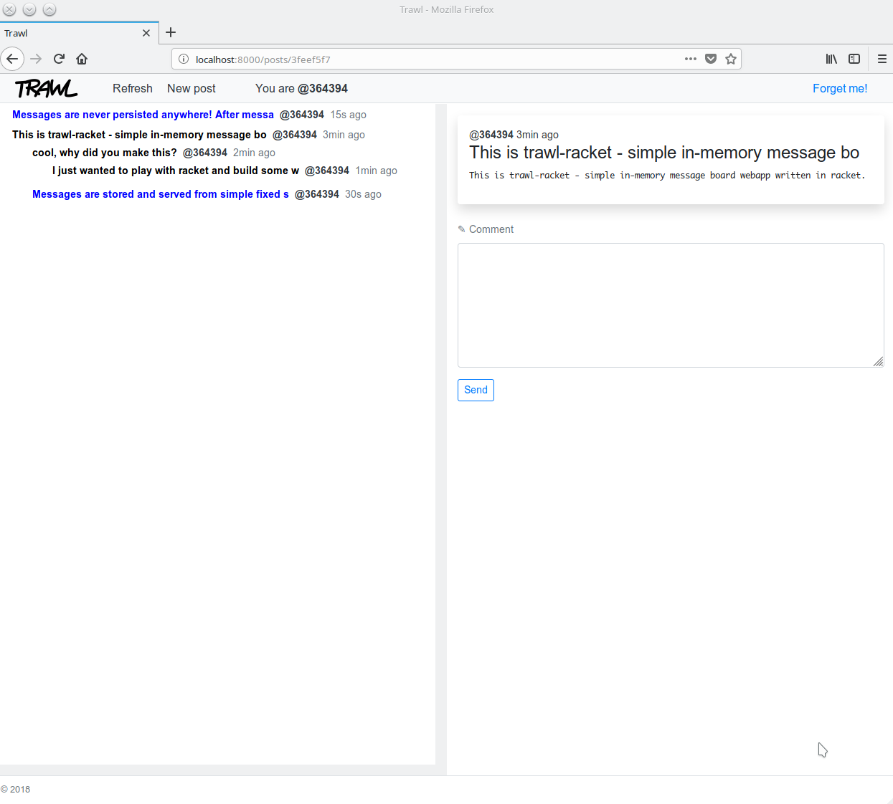

# trawl-racket
Simple in-memory message board webapp written in racket.

Messages are stored and served from simple fixed size in-memory "datastore" that
uses fifo method for cleaning old messages out of the way. 

Messages are never persisted anywhere other than memory! 
After messages are posted they will stay in memory and they are shown in the message board until 
new incoming messages pushes them away or when the server terminates.

All posts are posted anonymously with randomly generated userid that is valid until user ends
the session or decides to abandon the userid.

No external server-side dependencies used, only racket standard library!

## build
```
$ raco exe server.rkt
```
## run
```
$ ./server
Your Web application is running at http://localhost:8000/posts.
```
## screenshot


